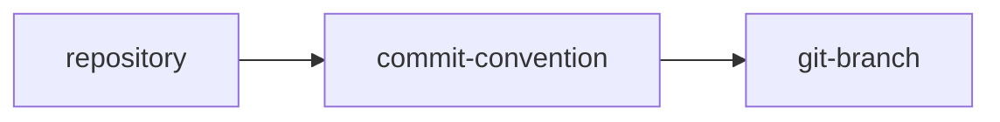
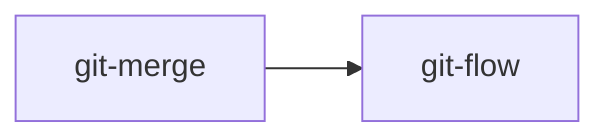
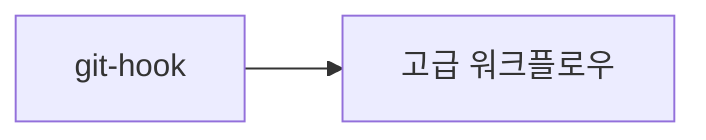

# 🚀 GitHub Study 완벽 가이드

> **Git과 GitHub를 처음부터 끝까지 마스터하는 종합 학습 저장소**

[](https://github.com/FISA-STUDY/Github-study/stargazers)
[](https://github.com/FISA-STUDY/Github-study/network/members)
[](https://github.com/FISA-STUDY/Github-study/graphs/contributors)

---

## 📚 학습 목차

이 저장소는 Git과 GitHub의 모든 것을 체계적으로 학습할 수 있도록 구성되어 있습니다.

### 🗂️ 폴더별 학습 내용

| 폴더 | 주제 | 난이도 | 설명 |
|------|------|--------|------|
| 📁 [`commit-convention`](./commit-convention/) | 커밋 컨벤션 | ⭐⭐ | 좋은 커밋 메시지 작성법과 컨벤션 |
| 📁 [`git-branch`](./git-branch/) | 브랜치 관리 | ⭐⭐⭐ | 브랜치 생성, 이동, 병합, 삭제 |
| 📁 [`git-flow`](./git-flow/) | Git Flow | ⭐⭐⭐⭐ | Git Flow 전략과 워크플로우 |
| 📁 [`git-hook`](./git-hook/) | Git Hook | ⭐⭐⭐⭐⭐ | 자동화를 위한 Git Hook 활용 |
| 📁 [`git-merge`](./git-merge/) | 병합 전략 | ⭐⭐⭐ | Merge, Rebase, Squash 전략 |
| 📁 [`repository`](./repository/) | 저장소 관리 | ⭐⭐ | 원격/로컬 저장소 설정과 관리 |

---

## 🎯 학습 로드맵

### 1️⃣ **기초 단계** (필수)


- **[📁 repository](./repository/)**: Git 저장소 기본 개념과 원격/로컬 저장소 관리
- **[📁 commit-convention](./commit-convention/)**: 효과적인 커밋 메시지 작성법
- **[📁 git-branch](./git-branch/)**: 브랜치 생성, 이동, 관리

### 2️⃣ **중급 단계**


- **[📁 git-merge](./git-merge/)**: 다양한 병합 전략과 충돌 해결
- **[📁 git-flow](./git-flow/)**: 체계적인 브랜치 전략과 릴리즈 관리

### 3️⃣ **고급 단계**


- **[📁 git-hook](./git-hook/)**: 자동화와 품질 관리를 위한 Git Hook

---

## 🚀 빠른 시작

### 1. 저장소 복제
```bash
# HTTPS
git clone https://github.com/FISA-STUDY/Github-study.git

# SSH
git clone git@github.com:FISA-STUDY/Github-study.git
```

### 2. 디렉토리 이동
```bash
cd Github-study
```

### 3. 학습할 주제 선택
```bash
# 예: 브랜치 학습
cd git-branch
cat README.md
```
---

## 🛠️ 실습 환경 설정

### Git 설치 확인
```bash
git --version
```

### Git 초기 설정
```bash
# 사용자 정보 설정
git config --global user.name "Your Name"
git config --global user.email "your.email@example.com"

# 기본 에디터 설정 (선택사항)
git config --global core.editor "code --wait"

# 설정 확인
git config --list
```

### GitHub CLI 설치 (선택사항)
```bash
# macOS
brew install gh

# Windows (Chocolatey)
choco install gh

# 인증
gh auth login
```

---
