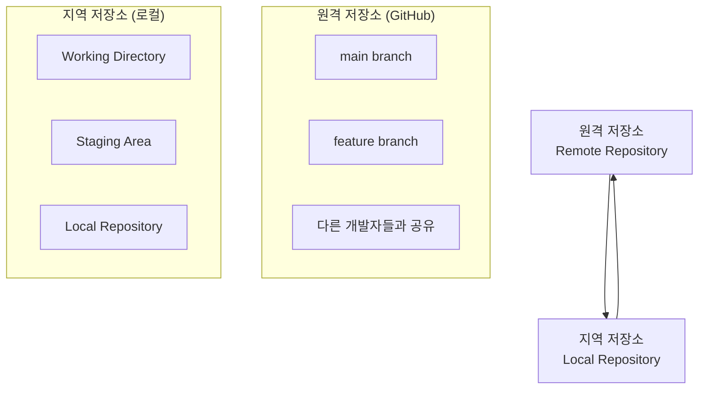

# 🚀 Git 원격 저장소 완벽 가이드

## 🌐 원격 저장소 개념

### 원격 저장소 vs 지역 저장소



### 🐙 GitHub이란?
원격 저장소의 기능을 웹에서 제공하는 서비스 중 하나가 **GitHub**입니다.
- 코드 저장 및 버전 관리
- 협업 및 코드 리뷰
- 이슈 트래킹 및 프로젝트 관리

---

## 🔄 Git Clone vs Git Pull

### 📥 Git Clone
> **초기 다운로드 시 사용하는 명령어**

```bash
git clone {URL}
```

**내부적으로 실행되는 명령어들:**
```bash
git init                    # Git 프로젝트 시작
git remote add origin {URL} # 원격 저장소 연결
git pull origin master      # 원격 저장소 내용 다운로드
```

### 🔄 Git Pull
> **이미 연결된 원격 저장소에서 업데이트 사항을 받아올 때 사용**

```bash
git pull
```

**연결 상태 확인:**
```bash
git remote -v  # 현재 연결된 원격 저장소 확인
```

---

## 🛠️ 실습 단계별 가이드

### 0단계: GitHub에서 Fork 하기 🍴


먼저 GitHub에서 원하는 저장소를 **Fork**하여 자신의 계정에 복사합니다.

### 1단계: 저장소 클론하기 📦


```bash
git clone https://github.com/hyewon8245/Github-study.git
```

### 2단계: 브랜치 확인하기 🔍


```bash
$ git branch -a
# 현재 branch를 모두 보여줌
# 현재 브렌치는 main만 있는 걸 확인가능
```

### 3단계: 새 브랜치 생성 및 이동 🌿


```bash
$ git checkout -b hyewon
# branch 생성 및 변경
# 예시로 hyewon을 branch를 생성함
```

### 4단계: Git 사용자 설정 ⚙️


```bash
$ git config --global user.name "hyewon8245"
$ git config --global user.email "yully8245@gmail.com"
# git 초기 설정
```

### 5단계: 파일 추가 및 스테이징 📝


```bash
git status
git add hyewon_check.txt
# hyewon_check.txt 개인적으로 만든 파일 넣기
```

### 6단계: 첫 번째 푸시 시도 🚀


```bash
git push -u origin hyewon
# origin 저장소에 branch hyewon에 저장하기
# 아직 되진 않음. github에 로그인을 해야함
```

⚠️ **주의**: 첫 번째 푸시 시도 시 인증이 필요합니다!

### 7단계: 커밋 및 최종 푸시 ✅


```bash
git status
# 현재 branch와 상태 확인가능
git commit -m "Your commit message here"
# commit -m으로 commit message를 바로 적을 수 있음
git push origin hyewon
# push한다
```

🎉 **성공!** text파일이 저장된 걸 확인할 수 있습니다.

---

## 🚨 일반적인 문제와 해결방법

### 1. 인증 오류
```bash
git push -u origin hyewon
# → GitHub 로그인이 필요합니다!
```
**해결방법**: GitHub 계정으로 로그인 후 다시 시도

### 2. 커밋하지 않고 푸시 시도
```bash
git push origin hyewon
# → 변경사항이 커밋되지 않았습니다!
```
**해결방법**: 먼저 커밋 후 푸시
```bash
git commit -m "Your commit message"
git push origin hyewon
```

---

## 📊 실습 결과

### ✅ 성공 확인 사항

- [x] GitHub에서 저장소 Fork 완료
- [x] 로컬로 저장소 Clone 완료
- [x] 새로운 브랜치 `hyewon` 생성 완료
- [x] Git 사용자 설정 완료
- [x] 개인 파일 `hyewon_check.txt` 추가 완료
- [x] GitHub 인증 완료
- [x] 커밋 생성 완료
- [x] 원격 저장소에 성공적으로 푸시 완료
- [x] GitHub에서 새 브랜치와 파일 확인 가능

### 🎯 핵심 포인트

> **중요**: 
> 1. 처음 푸시할 때는 GitHub 인증이 필요합니다
> 2. 변경사항은 반드시 커밋 후 푸시해야 합니다
> 3. `-u` 옵션으로 업스트림 브랜치를 설정하세요

```bash
git push -u origin hyewon  # 첫 번째 푸시 (인증 필요)
git commit -m "message"    # 먼저 커밋
git push origin hyewon     # 그 다음 푸시
```

---

## 🔧 자주 사용하는 Git 명령어

| 명령어 | 설명 |
|--------|------|
| `git status` | 현재 작업 상태 확인 |
| `git branch -a` | 모든 브랜치 목록 확인 |
| `git checkout -b <branch>` | 새 브랜치 생성 및 이동 |
| `git add <file>` | 파일 스테이징 |
| `git commit -m "<message>"` | 커밋 생성 |
| `git push origin <branch>` | 원격 저장소에 푸시 |
| `git push -u origin <branch>` | 첫 푸시 (업스트림 설정) |
| `git pull` | 원격 저
